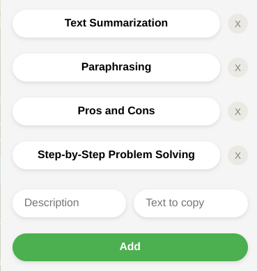

# Text+

## Description
**Text+** is a Chrome extension designed to store and copy prompts and templates with custom descriptions. It provides a simple and efficient way to manage frequently used prompts, making it easier to access and paste them as needed, which is particularly useful for feeding Large Language Models (LLMs), ultimately enhancing your workflow when interacting with AI systems.


## Features
- Store prompts and templates with custom descriptions.
- Quick copy functionality with a single click.
- Organize different prompt types (e.g., creative writing, text summarization, step-by-step problem solving).
- Easy deletion of stored entries.
- Simple and intuitive user interface.
- Persists data across browser sessions.


## Extension Preview


*The **Text+** popup interface, showing stored prompts and fields for adding new ones.*


## Installation
1. **Clone this repository.**
   - To clone this repository, you can use the following command in your terminal:

    ```bash
    git clone https://github.com/RafaelCarreres/text-plus.git
    ```
2. **Load the Extension in Chrome:**

    - Open Chrome and navigate to ```chrome://extensions/```
    - Enable Developer mode by toggling the switch in the top-right corner.
    - Click "Load unpacked" and select the directory where you cloned the repository.


## Usage
1. Click on the **Text+** icon in your Chrome toolbar to open the popup.
2. To add a new prompt or template:
   - Enter a descriptive name in the "Description" field (e.g., "Creative Writing Prompt").
   - Enter the prompt or template in the "Text to copy" field.
   - Click the "Add" button or press Enter.
3. To copy a prompt or template:
   - Click on the description button of the desired entry.
   - The prompt will be copied to your clipboard, ready to be pasted into your LLM interface.
   - The popup will close automatically after copying.
4. To delete an entry:
   - Click the "X" button next to the entry you wish to remove.


## Permissions
**Text+** requires the following permissions:
- `storage`: To save your prompts and templates locally in your browser.
- `clipboardWrite`: To copy your selected prompt to the clipboard.


## Privacy
**Text+** is designed with your privacy in mind:
- All data is stored locally on your device using Chrome's storage API.
- No data is sent to external servers or third parties.
- Your prompts and templates are only accessible by you and are not shared.


## Development
This extension is built using vanilla JavaScript, HTML, and CSS. The main files are:
- `popup.html`: The HTML structure of the popup
- `popup.js`: The JavaScript file handling the extension's functionality
- `popup.css`: The CSS file for styling the popup
- `manifest.json`: The extension's manifest file


## License
MIT
